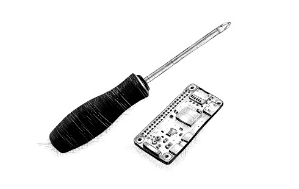

> 我们认为我们是为了自己的目的而创建系统。我们相信我们是根据自己的形象来构建系统的……但计算机与我们并不完全一样。它只是我们自身非常小的一部分的投影：那部分专注于逻辑、秩序、规则和清晰度。
>
> 艾伦·厄尔曼，《接近机器：技术狂热及其不满》

这是一本关于指导计算机的书。如今，计算机就像螺丝刀一样常见，但它们比螺丝刀要复杂得多，让它们做你想做的事并不总是那么容易。

如果你要电脑执行的任务是常见的、易于理解的任务，例如显示电子邮件或充当计算器，那么你可以打开相应的应用程序并开始工作。但对于独特或开放式的任务，通常没有合适的应用程序。

编程就是为此而生的。编程就是编写程序的行为 —— 一组告诉计算机该做什么的精确指令。由于计算机是愚蠢、迂腐的野兽，编程从根本上来说是乏味而令人沮丧的。

幸运的是，如果你能克服这个事实 —— 甚至享受用愚蠢的机器可以处理的严谨思维 —— 编程可以带来回报。它让你在几秒钟内完成手工需要很长时间才能完成的事情。这是一种让你的计算机工具做以前无法做到的事情的方法。最重要的是，它是一种解决谜题和抽象思维的精彩游戏。

大多数编程都是用编程语言完成的。编程语言是一种人工构建的语言，用于指导计算机。有趣的是，我们发现与计算机通信的最有效方式大量借鉴了我们彼此交流的方式。与人类语言一样，计算机语言允许以新的方式组合单词和短语，从而可以表达新的概念。

曾经，基于语言的界面（例如 20 世纪 80 年代和 90 年代的 BASIC 和 DOS 提示符）是与计算机交互的主要方法。对于日常计算机使用，这些界面已基本被可视化界面所取代，后者更容易学习，但自由度较低。但是，如果你知道去哪里找，这些语言仍然存在。其中一种语言 JavaScript 内置于每个现代网络浏览器中，因此几乎可以在所有设备上使用。

本书将尝试让您足够熟悉这门语言，以便用它做一些有用和有趣的事情。

## 关于编程
