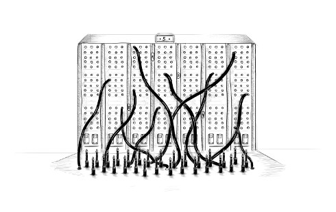

> 网络背后的梦想是建立一个公共信息空间，我们可以通过共享信息进行交流。它的普遍性至关重要：超文本链接可以指向任何内容，无论是个人、本地还是全球，无论是草稿还是经过精心打磨。
>
> —— 蒂姆·伯纳斯·李，《万维网：一段非常简短的个人经历》



本书的下一章将讨论 Web 浏览器。没有浏览器，就不会有 JavaScript——或者即使有，也不会有人关注它。

Web 技术从一开始就是分散的，不仅在技术上如此，在发展方式上也是如此。各种浏览器供应商都以临时的、有时是未经深思熟虑的方式添加了新功能，这些功能有时会被其他供应商采用，并最终被纳入标准。

这既是好事也是坏事。一方面，没有中央控制方来控制系统，而是通过各方以松散的协作（或偶尔公开敌对）的方式对其进行改进，这令人感到鼓舞。另一方面，网络开发方式杂乱无章，这意味着最终的系统并不是内部一致性的光辉典范。其中有些部分简直令人困惑，设计也很糟糕。

## 网络和互联网

计算机网络自 20 世纪 50 年代就已出现。如果你在两台或多台计算机之间连接电缆，并允许它们通过这些电缆来回发送数据，你就可以做各种奇妙的事情。

如果将同一栋建筑内的两台机器连接起来可以让我们实现许多奇妙的事情，那么将全球各地的机器连接起来应该会更棒。实现这一愿景的技术是在 20 世纪 80 年代开发的，由此产生的网络被称为互联网。它已经实现了自己的承诺。

计算机可以使用此网络向另一台计算机发送比特。要通过这种比特发送实现任何有效的通信，两端的计算机必须知道这些比特应该代表什么。任何给定的比特序列的含义完全取决于它试图表达的内容以及所使用的编码机制。

网络协议描述了网络上的通信方式。有用于发送电子邮件、获取电子邮件、共享文件甚至控制被恶意软件感染的计算机的协议。

超文本传输 ​​ 协议(HTTP) 是一种用于检索命名资源（信息块，例如网页或图片）的协议。它指定发出请求的一方应以如下行开头，命名资源以及它尝试使用的协议版本：

```bash
GET /index.html HTTP/1.1
```

<!-- TODO -->

关于请求者如何在请求中包含更多信息以及返回资源的另一端如何打包其内容，还有更多规则。我们将在第 18 章中更详细地介绍 HTTP 。

大多数协议都是建立在其他协议之上的。HTTP 将网络视为一种流式设备，您可以将位放入其中并让它们以正确的顺序到达正确的目的地。在网络为您提供的原始数据发送之上提供这些保证已经是一个相当棘手的问题。

传输控制协议(TCP) 就是解决此问题的协议。所有联网设备都“讲”它，互联网上的大部分通信都建立在它之上。

TCP 连接的工作原理如下：一台计算机必须等待或监听其他计算机开始与其通信。为了能够在一台机器上同时监听不同类型的通信，每个监听器都有一个与之关联的编号（称为端口）。大多数协议指定默认情况下应使用哪个端口。例如，当我们想使用 SMTP 协议发送电子邮件时，我们发送邮件的机器应该监听端口 25。

然后，另一台计算机可以通过使用正确的端口号连接到目标计算机来建立连接。如果可以访问目标计算机并且该计算机正在侦听该端口，则连接已成功创建。侦听计算机称为服务器，而连接计算机称为客户端。

这样的连接就像一个双向管道，比特可以通过它流动——两端的机器都可以将数据放入其中。一旦比特成功传输，另一端的机器就可以再次读取它们。这是一个方便的模型。你可以说 TCP 提供了网络的抽象。

## 网络

万维网（不要与整个互联网混淆）是一组协议和格式，允许我们在浏览器中访问网页。Web 一词指的是这些页面可以轻松相互链接，从而连接成一个巨大的网格，用户可以在其中移动。

要成为网络的一部分，您需要做的就是将一台机器连接到互联网，并让它使用 HTTP 协议监听端口 80，以便其他计算机可以向其请求文档。

网络上的每个文档都由统一资源定位器（URL）命名，其形式如下：

```bash
http://eloquentjavascript.net/13_browser.html
```

- 协议 => http://
- 服务器 => eloquentjavascript.net
- 路径 => /13_browser.html

第一部分告诉我们此 URL 使用 HTTP 协议（而不是加密的 HTTP，即 https:// ）。接下来的部分标识我们从哪个服务器请求文档。最后是路径字符串，用于标识我们感兴趣的文档（或资源）。

连接到互联网的机器会获得一个 IP 地址，这是一个可以用来向该机器发送消息的数字，看起来像 149.210.142.219 或 2001:4860:4860::8888。由于或多或少随机的数字列表很难记住并且输入起来很麻烦，因此您可以为一个地址或一组地址注册一个域名。我注册了 eloquentjavascript.net 来指向我控制的机器的 IP 地址，因此可以使用该域名来提供网页。

如果您在浏览器的地址栏中输入此 URL，浏览器将尝试检索并显示该 URL 上的文档。首先，您的浏览器必须找出 eloquentjavascript.net 所指的地址。然后，它将使用 HTTP 协议连接到该地址上的服务器并请求资源 /13_browser.html。如果一切顺利，服务器将返回一个文档，然后您的浏览器会将其显示在屏幕上。

## HTML

HTML 代表超文本标记语言，是网页使用的文档格式。HTML 文档包含文本以及赋予文本结构的标签，用于描述链接、段落和标题等内容。

一个简短的 HTML 文档可能看起来像这样：

```html
<!DOCTYPE html>
<html>
  <head>
    <meta charset="utf-8" />
    <title>My home page</title>
  </head>
  <body>
    <h1>My home page</h1>
    <p>Hello, I am Marijn and this is my home page.</p>
    <p>
      I also wrote a book! Read it
      <a href="http://eloquentjavascript.net">here</a>.
    </p>
  </body>
</html>
```

标签用尖括号（< 和 >，也就是小于和大于符号）括起来，提供有关文档结构的信息。其他文本只是纯文本。

该文档以 <!doctype html> 开头，它告诉浏览器将页面解释为现代 HTML，而不是过去使用的过时样式。

HTML 文档有头部和主体。头部包含文档信息，主体包含文档本身。在本例中，头部声明此文档的标题为“我的主页”，并使用 UTF-8 编码，这是一种将 Unicode 文本编码为二进制数据的方法。文档主体包含一个标题（<h1\>，表示“标题 1” <h2\> — <h6\> 生成子标题）和两个段落（<p\>）。

标签有多种形式。元素,例如正文、段落或链接以开始标签像 <p\> 开始，以结束标签</p\> 结束。某些开始标签以成对的形式 name="value" 包含额外信息。这些称为属性。例如链接的开始标签 (<a\>)。在这种情况下，链接的目标用 href 表示（href="http://eloquentjavascript.net"），其中 href 代表“超文本引用”。

有些标签不包含任何内容，因此无需关闭。元数据标签<meta charset="utf-8"\>就是一个例子。

为了能够在文档文本中包含尖括号（即使它们在 HTML 中具有特殊含义），必须引入另一种特殊符号。普通的左尖括号写作<code>&lt;</code>（“小于”），右尖括号写作<code>&gt;</code>（“大于”）。在 HTML 中，一个与号 (&) 字符后跟一个名称或字符代码以及一个分号 (;) 称为实体，将被其编码的字符替换。

这类似于 JavaScript 字符串中反斜杠的使用方式。由于此机制也赋予了 & 符号特殊含义，因此需要将其转义为 <code>&amp;</code>。在用双引号括起来的属性值中，<code>&quot;</code>可用于插入文字引号字符。

HTML 的解析方式具有极强的容错能力。当缺少应有的标签时，浏览器会自动添加这些标签。此方式已标准化，您可以依赖所有现代浏览器以相同的方式执行此操作。

以下文档将按照前面显示的格式进行处理：

```html
<!doctype html>

<meta charset=utf-8>
<title>My home page</title>

<h1>My home page</h1>
<p>Hello, I am Marijn and this is my home page.
<p>I also wrote a book! Read it
  <a href=http://eloquentjavascript.net>here</a>.
```

<html\>、<head\>和标签<body\>完全消失了。浏览器知道<meta\>和<title\>属于头部，这<h1\>意味着主体部分已经开始。此外，我不再显式地关闭段落，因为打开新段落或结束文档将隐式关闭它们。属性值周围的引号也消失了。

本书通常会省略示例中的<html\>、<head\>和<body\>标签，以使其简短且不杂乱。不过，我会关闭标签并在属性周围添加引号。

我通常还会省略文档类型和 charset 声明。不要将此视为鼓励从 HTML 文档中删除它们。当您忘记它们时，浏览器通常会做出荒谬的事情。考虑将文档类型和 charset 元数据隐式地存在于示例中，即使它们实际上并未显示在文本中。

## HTML 和 JavaScript

在本书的上下文中，最重要的 HTML 标签是<script\>，它允许我们在文档中包含一段 JavaScript。

```html
<h1>Testing alert</h1>
<script>
  alert("hello!");
</script>
```

<script\>浏览器读取 HTML 时，只要遇到其标签，就会运行此类脚本。此页面打开时会弹出一个对话框 — 该 alert 功能类似于 prompt，因为它会弹出一个小窗口，但只显示一条消息而不要求输入。

直接在 HTML 文档中包含大型程序通常是不切实际的。<script\>可以给标签赋予一个 src 属性，以便从 URL 获取脚本文件（包含 JavaScript 程序的文本文件）。

```html
<h1>Testing alert</h1>
<script src="code/hello.js"></script>
```

这里包含的 code/hello.js 文件包含相同的程序 —— alert("hello!")。当 HTML 页面引用其他 URL 作为其自身的一部分（例如图像文件或脚本）时，Web 浏览器将立即检索它们并将其包含在页面中。

脚本标记必须始终以 </script\> 结束，即使它引用的是脚本文件且不包含任何代码。如果您忘记了这一点，页面的其余部分将被解释为脚本的一部分。

<!--  -->

您可以通过为脚本标记添加属性来在浏览器中加载 ES 模块（请参阅第 10 章 type="module"） 。此类模块可以通过在声明中使用相对于自身的 URL 作为模块名称来依赖于其他模块 import。

某些属性还可以包含 JavaScript 程序。标签<button\>（显示为按钮）支持 onclick 属性。只要单击按钮，就会运行该属性的值。

```html
<button onclick="alert('Boom!');">DO NOT PRESS</button>
```

请注意，我必须对属性中的字符串使用单引号 onclick，因为双引号已用于引用整个属性。我也可以使用<code>&quot;</code>来转义内部引号。

## 在沙箱中

运行从互联网下载的程序具有潜在危险。您不太了解所访问的大多数网站背后的人，而且他们不一定怀有善意。运行恶意行为者的程序会导致您的计算机感染病毒、数据被盗以及您的帐户被黑客入侵。

然而，网络的吸引力在于，您可以浏览它而不必信任您访问的所有页面。这就是浏览器严格限制 JavaScript 程序可以执行的操作的原因：它不能查看您计算机上的文件或修改与其嵌入的网页无关的任何内容。

以这种方式隔离编程环境称为沙盒，其理念是程序在沙盒中无害地运行。但你应该想象这种特殊的沙盒就像笼子一样，笼子外面有厚厚的钢筋，这样运行其中的程序就无法逃脱。

沙盒的难点在于，它既要给程序足够的空间，又要限制它们做任何危险的事情。许多有用的功能，比如与其他服务器通信或读取复制粘贴剪贴板的内容，也可能被用于有问题的、侵犯隐私的目的。

时不时地，有人会想出新方法来绕过浏览器的限制并做一些有害的事情，从泄露少量的私人信息到控制运行浏览器的整台机器。浏览器开发人员的回应是修复漏洞，一切又恢复正常——直到下一个问题被发现，希望它会被公开，而不是被一些政府机构或犯罪组织秘密利用。

## 兼容性和浏览器之争

在网络发展的早期阶段，一款名为 Mosaic 的浏览器占据了市场主导地位。几年后，平衡转移到了 Netscape，而后者又被微软的 Internet Explorer 取代。当某个浏览器占据主导地位时，该浏览器的供应商就会觉得有权单方面为网络发明新功能。由于大多数用户都使用最受欢迎的浏览器，因此网站会开始使用这些功能，而不会考虑其他浏览器。

这是兼容性的黑暗时代，通常被称为浏览器之战。Web 开发人员面临的不是统一的 Web，而是两三个不兼容的平台。更糟糕的是，2003 年左右使用的浏览器都充满了错误，当然每个浏览器的错误都不同。编写网页的人的日子不好过。

2000 年代后期，Netscape 的非营利分支 Mozilla Firefox 挑战了 Internet Explorer 的地位。由于微软当时对保持竞争力并不特别感兴趣，Firefox 从其手中夺走了大量市场份额。大约在同一时间，谷歌推出了 Chrome 浏览器，而苹果的 Safari 浏览器也大受欢迎，导致出现了四大巨头的局面，而不是一家。

新玩家对标准和更好的工程实践的态度更加严肃，这让我们的不兼容性和错误更少。微软看到其市场份额不断下滑，于是改变了态度，在其 Edge 浏览器中采用了这些态度，该浏览器取代了 Internet Explorer。如果你今天才开始学习 Web 开发，那你可真是幸运。主流浏览器的最新版本表现得相当统一，错误相对较少。

不幸的是，随着 Firefox 的市场份额越来越小，以及 Edge 在 2018 年仅仅成为 Chrome 核心的包装，这种统一性可能再次以单一供应商的形式出现——这次是谷歌——对浏览器市场拥有足够的控制权，将其对网络应该是什么样子的想法推向世界其他地方。

无论如何，这一连串的历史事件和意外事件造就了我们今天所拥有的 Web 平台。在接下来的章节中，我们将为其编写程序。
